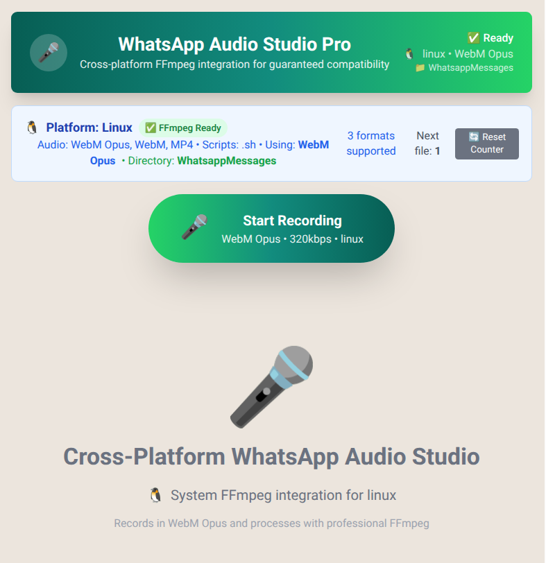

# WhatsApp Audio Studio

🎤 **The audio recorder that makes WhatsApp voice messages actually bearable**

## Why This Tool?

**The Problem:** WhatsApp's built-in recorder sucks - <br>poor quality, compression hell, your professional microphone -> **has no power here!** 🧙

**The Solution:** A clean browser-based recorder that creates high-quality WebM files, <br>paired with a smart FFmpeg watchdog that auto-converts everything for WhatsApp in the background.

**The Result:** Professional audio quality for WhatsApp, zero hassle. 🎯

<br>
<br>



<br>
<br>

## Features

✅ Clean WebM Opus @ 320kbps recording  
✅ Auto-numbered files (1.webm, 2.webm, 3.webm...)  
✅ Background FFmpeg conversion to WhatsApp-ready .ogg  
✅ Runs as system service - survives reboots  
✅ One-time setup, then forget about it

## Quick Start

### 1. Install the App
```bash
git clone https://github.com/yourusername/whatsapp-audio-studio.git
cd whatsapp-audio-studio
npm install && npm start
```

### 2. Setup Browser
- Open `http://localhost:3000`
- Grant mic permissions
- Choose audio output folder

### 3. Install Watchdog (Linux)
```bash
cd webm-ffmpeg-watchdog
sudo apt install ffmpeg inotify-tools

# Install as system service
sudo cp *.sh /usr/local/bin/ && sudo chmod +x /usr/local/bin/*.sh
sudo cp whatsapp-converter.service /etc/systemd/system/
sudo systemctl daemon-reload && sudo systemctl enable --now whatsapp-converter.service
```

## How It Works

**Simple Workflow:**
1. **Record** → App creates numbered .webm files
2. **Auto-convert** → Watchdog turns them into .ogg files for WhatsApp
3. **Upload** → Drag .ogg files directly to WhatsApp

**File Flow:**
```
Record:  1.webm, 2.webm, 3.webm... (browser app)
Result:  1.ogg, 2.ogg, 3.ogg...   (watchdog service)
```

**Default watch folder:** `~/Music/WhatsappMessages/`

## Architecture

**Clean separation:**
- **Web App**: Pure audio recording, clean numbered output
- **System Service**: Automatic FFmpeg processing via inotify + systemd
- **Zero maintenance**: Set it up once, runs forever

## Project Structure

```
whatsapp-audio-studio/
├── src/                          # React recording app
├── webm-ffmpeg-watchdog/         # Auto-conversion service
│   ├── watch-whatsapp-folder.sh  # inotify watchdog
│   ├── ffmpeg-converter.sh       # conversion wrapper
│   └── whatsapp-converter.service # systemd service
└── package.json
```

## Service Management

```bash
# Check status
sudo systemctl status whatsapp-converter.service

# View logs
journalctl -u whatsapp-converter.service -f

# Restart if needed
sudo systemctl restart whatsapp-converter.service
```


## Usage

1. **Record** audio in browser → creates .webm files
2. **Wait 2 seconds** → watchdog auto-converts to .ogg
3. **Upload** .ogg files to WhatsApp → perfect quality

**That's it.** No manual conversion, no file management, no thinking required. 🚀

---

*See `webm-ffmpeg-watchdog/README.md` for detailed watchdog configuration.*
