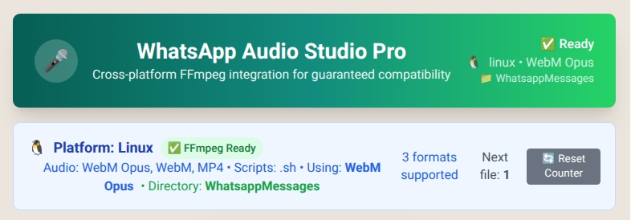

# WhatsApp Audio Studio

🎤 **The audio recorder that makes WhatsApp voice messages actually bearable**



## Why This Tool?

**The Problem:** WhatsApp's Web built-in recorder sucks, poor quality, compression hell - <br>in other words -> **Your professional microphone *has no power here!*** 🧙

**The Solution:** A clean browser-based recorder that creates high-quality WebM files, paired with a smart FFmpeg watchdog that auto-converts everything for WhatsApp in the background.

**The Result:** Professional audio quality for WhatsApp, zero hassle. 🎯

---

## ✨ Features

✅ **Clean WebM Opus @ 320kbps recording**  
✅ **Auto-numbered files** (1.webm, 2.webm, 3.webm...)  
✅ **Background FFmpeg conversion** to WhatsApp-ready .ogg  
✅ **Runs as system services** - survives reboots  
✅ **One-click installation** with automatic service setup  
✅ **Cross-platform support** (Arch Linux & Debian/Ubuntu)  
✅ **One-time setup, then forget about it**

---

## 🚀 Quick Test (Before Installation)

Want to try the web app first? No problem!

```bash
# Clone and test the web app
git clone https://github.com/yourusername/whatsapp-audio-studio.git
cd whatsapp-audio-studio
npm install
npm start
```

- Open `http://localhost:3000`
- Grant microphone permissions
- Test recording functionality
- Choose a temporary output folder for testing

**Note:** Without the installer, you won't have automatic .ogg conversion - the watchdog service needs to be properly installed for that.

---

## 🛠️ Full Installation (Recommended)

The installer handles **everything automatically**:
- Installs dependencies (ffmpeg, inotify-tools, Node.js)
- Sets up both React server AND watchdog as system services
- Configures automatic startup on boot
- Creates the audio output folder
- Configures user permissions

### Run the Installer

```bash
# After cloning the repository
sudo ./installer.sh
```

**The installer will:**
1. ✅ Check and install all dependencies
2. ✅ Create the watchdog folder at `~/Music/WhatsappMessages/`
3. ✅ Install npm dependencies
4. ✅ Create systemd services for both web server and watchdog
5. ✅ Configure services to run as your user
6. ✅ Ask if you want services to start automatically on boot
7. ✅ Start both services immediately

**Interactive Options:**
- Choose whether to enable React server on boot
- Choose whether to enable watchdog service on boot

---

## 📱 How to Use

### Simple Workflow:
1. **Access Web App** → Open `http://localhost:3000`
2. **Configure Output** → Set audio folder to `~/Music/WhatsappMessages/`
3. **Record** → App creates numbered .webm files (1.webm, 2.webm, 3.webm...)
4. **Auto-convert** → Watchdog turns them into .ogg files for WhatsApp
5. **Upload** → Drag .ogg files directly to WhatsApp

### File Flow:
```
Record:  1.webm, 2.webm, 3.webm... (browser app)
         ↓ (automatic conversion)
Result:  1.ogg, 2.ogg, 3.ogg...   (watchdog service)
```

---

## ⚠️ Important Notes

### Critical Configuration:
- **Output Folder:** You MUST set the web app's output folder to `~/Music/WhatsappMessages/`
- **Don't Move/Delete:** Never move or delete the `~/Music/WhatsappMessages/` folder - the watchdog service depends on it
- **File Detection:** The watchdog only processes .webm files placed in this exact folder

### Web App Setup:
1. Open `http://localhost:3000`
2. In the web app settings, set output folder to: `/home/YOURUSERNAME/Music/WhatsappMessages/`
3. Grant microphone permissions when prompted

---

## 🔧 Service Management

Both the web server and watchdog run as systemd services:

### Check Status:
```bash
# Check if services are running
sudo systemctl status whatsapp-audio-server.service
sudo systemctl status audio-webm-watcher.service
```

### View Logs:
```bash
# Monitor logs in real-time
journalctl -u whatsapp-audio-server.service -f
journalctl -u audio-webm-watcher.service -f

# Check watchdog activity
tail -f /tmp/watchdog.log
```

### Restart Services:
```bash
# Restart if needed
sudo systemctl restart whatsapp-audio-server.service
sudo systemctl restart audio-webm-watcher.service
```

### Enable/Disable Autostart:
```bash
# Enable services to start on boot
sudo systemctl enable whatsapp-audio-server.service
sudo systemctl enable audio-webm-watcher.service

# Disable autostart
sudo systemctl disable whatsapp-audio-server.service
sudo systemctl disable audio-webm-watcher.service
```

---

## 🏗️ Architecture

**Clean separation of concerns:**
- **Web App (React)**: Pure audio recording, clean numbered output
- **System Service**: Automatic FFmpeg processing via inotify + systemd
- **Zero maintenance**: Set it up once, runs forever

### Project Structure:
```
whatsapp-audio-studio/
├── src/                          # React recording app
├── public/                       # Web app assets
├── webm-ffmpeg-watchdog/         # Auto-conversion service
│   ├── watch-whatsapp-folder.sh  # inotify watchdog
│   ├── ffmpeg-converter.sh       # conversion wrapper
│   └── audio-webm-watcher.service # systemd service
├── installer.sh                  # Automated installer
├── uninstaller.sh               # Clean removal
└── package.json
```

---

## 🐛 Troubleshooting

### Web App Not Loading:
```bash
# Check if server is running
sudo systemctl status whatsapp-audio-server.service

# Check for port conflicts
netstat -tlnp | grep :3000
```

### Files Not Converting:
```bash
# Check watchdog service
sudo systemctl status audio-webm-watcher.service

# Check watchdog logs
tail -f /tmp/watchdog.log

# Verify folder permissions
ls -la ~/Music/WhatsappMessages/
```

### Permission Issues:
```bash
# Re-run installer to fix permissions
sudo ./installer.sh
```

---

## 📋 System Requirements

**Supported Distributions:**
- Arch Linux (with pacman)
- Debian/Ubuntu (with apt)
- Other distributions: manual dependency installation required

**Dependencies (installed automatically):**
- Node.js v16+
- ffmpeg
- inotify-tools
- npm

---

## 🗑️ Uninstallation

Want to remove everything cleanly?

```bash
sudo ./uninstaller.sh
```

The uninstaller will:
- Stop and remove systemd services
- Remove watchdog scripts
- Optionally remove dependencies
- Optionally delete audio files and logs
- Clean up npm dependencies

---

## 🎯 Usage Tips

1. **First Time:** Run the quick test to familiarize yourself with the interface
2. **Production:** Use the installer for permanent setup
3. **Quality:** The app records at 320kbps Opus - much better than WhatsApp's default
4. **Workflow:** Record multiple messages, they auto-convert in background
5. **Upload:** Use the .ogg files for WhatsApp - they maintain quality

---

**That's it.** No manual conversion, no file management, no thinking required. 🚀

---

*For technical details about the watchdog service, see `webm-ffmpeg-watchdog/README.md`*